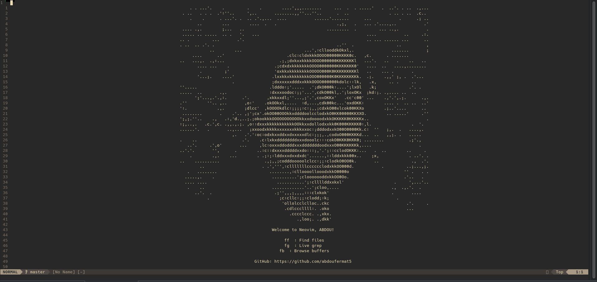

# My Neovim Configuration

This repository contains my personal Neovim configuration, designed for an enhanced coding experience.

## Structure

```
.
├── ascii_art2.txt
├── ascii_art.txt
├── assets
│   └── img-prev.png
├── init.lua
├── lua
│   ├── completion.lua
│   ├── custom_dashboard.lua
│   ├── lsp-config.lua
│   ├── nvim-tree-config.lua
│   ├── plugins.lua
│   ├── statusline-config.lua
│   ├── telescope-config.lua
│   └── treesitter-config.lua
└── README.md

```

## Preview:



## Features

- Custom dashboard with ASCII art
- LSP (Language Server Protocol) support
- Auto-completion
- File explorer (nvim-tree)
- Fuzzy finding (Telescope)
- Syntax highlighting (Treesitter)
- Custom status line

## Installation

1. Backup your existing Neovim configuration:
   ```
   mv ~/.config/nvim ~/.config/nvim.bak
   ```

2. Clone this repository:
   ```
   git clone https://github.com/abdoufermat5/my-nvim-config.git ~/.config/nvim
   ```

3. Install Packer (plugin manager):
   ```
   git clone --depth 1 https://github.com/wbthomason/packer.nvim\
    ~/.local/share/nvim/site/pack/packer/start/packer.nvim
   ```

4. Open Neovim and run:
   ```
   :PackerSync
   ```

## Customization

Feel free to modify the configuration files to suit your needs. The main configuration is in `init.lua`, with module-specific configurations in the `lua/` directory.

## Requirements

- Neovim (0.11 or later)
- Git
